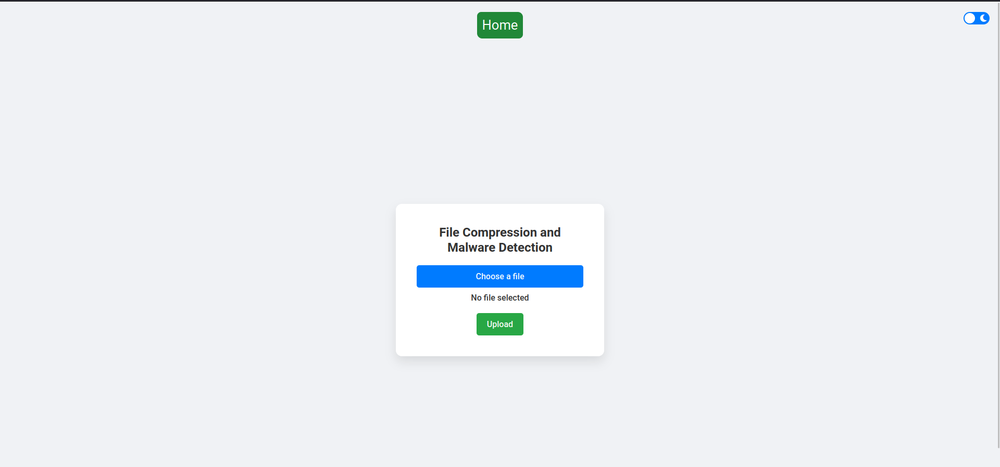
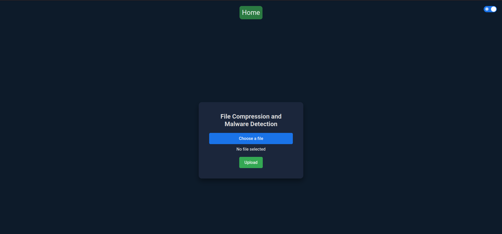

# File Compression and Malware Detection System

This Django application allows users to upload files, compress them using the maximum compression level, and detect if the file is malware.

#### Home Page 
Light Mode

Dark Mode


## Features

- Upload files for compression.
- Compress files to a maximum level using Deflate Algorithm.
- AI based Malware Detection trained using Decision Tree Algorithm.
- Detect malware based on MD5 hashes.
- Minimalistic and attractive frontend.


## Usages
You System must have the following things to use this File Compression And Malware Detection Project.
 - Installation of `python` and  `pip`

    Python is available for every platform. Download it according to you os. You can download it from [Here.](https://www.python.org/downloads/)


Follow the mentioned procedure to run this project in your local system.
 - Clone or Download the Repository
```bash
    git clone https://github.com/santoshvandari/MalwareDetectionApp.git 
    cd MalwareDetection
```
 - Create the Virtual Environment Before installing the requirements. 
 ```Bash
    python3 -m virtualenv venv #For Linux User
 ```
  - Activate the Virtual Environment
  ```bash
    source venv/bin/activate  #For Linux
     Note: It is not Necessary to Create Virtual Environment but recommanded.
  ``` 
 - Install the Requirements
```bash
    pip install -r requirements.txt
```
 - Make the Migrations and Migrate the Model
 ```bash
    # For making the Migrations
    python3 manage.py makemigrations
    # For Migrating the Model 
    python3 manage.py migrate
```
 - Load All the Hashes in the Database
 ```bash
    # It may take long time to load all the hashes in the database based on your System Performance. So I have already Loaded these Hashes. Just that database
    python3 manage.py loaddata
```

 - Run the Server
```bash
    python3 manage.py runserver #FOr Linux User
```
 - Open the url in Browser
 ```bash
    http://127.0.0.1:8000/ 
```

## Additional Information
All the Malware Hashes are stored in MalwareModel Directory and Some Malware Program(Please Don't Execute it in your System) is Stored in MalwareSample Directory.

There are about 0.78 Millions Hashes in the [MD5MalwareHashes.csv](./MalwareModel/MD5MalwareHashes.csv) file which is stored in Database to take More Accurate Decision.

The [Malware.csv](./MalwareModel/Malware.csv) file is used to Train the Model which contains about 0.13 Millions Malware and Legitimate Information.

## Contributing
We welcome contributions! If you'd like to contribute to this Malware Detection Project, please check out our [Contribution Guidelines](Contribution.md).

## Code of Conduct
Please review our [Code of Conduct](CodeOfConduct.md) before participating in this app.

## License
This project is licensed under the MIT [License](LICENSE).